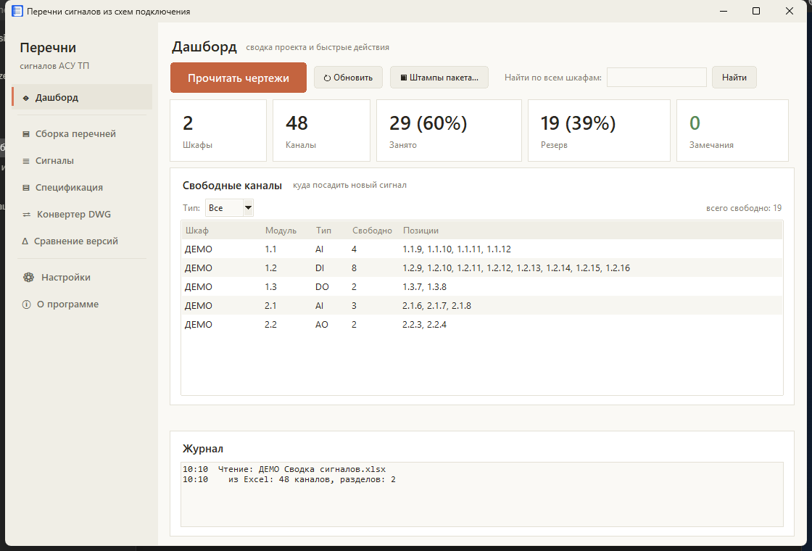
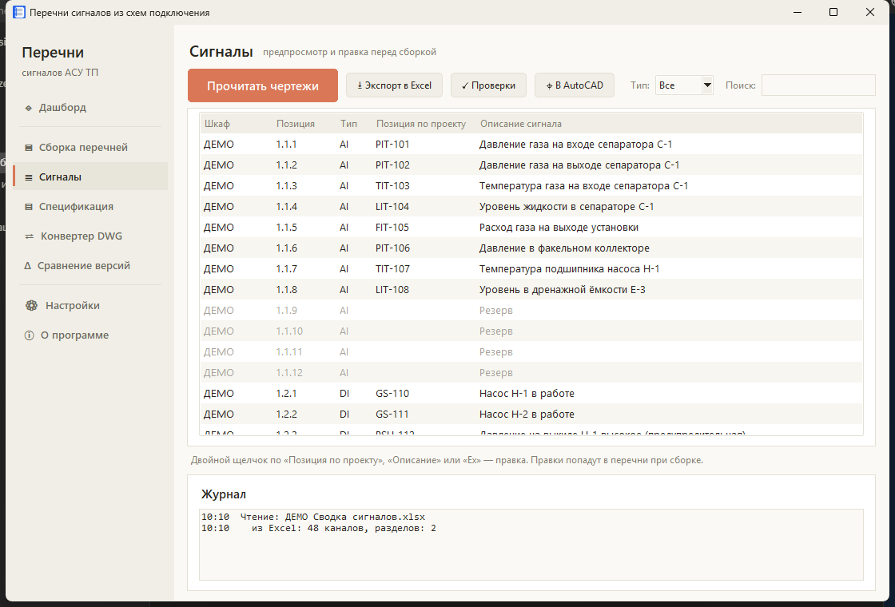
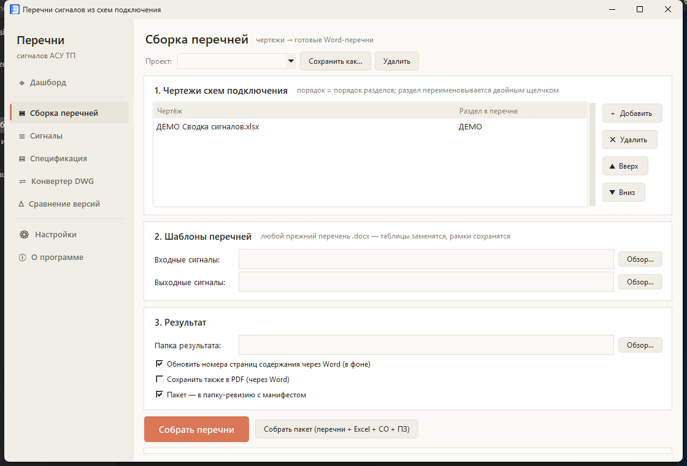

<div align="center">

# ⚡ Перечни сигналов из схем подключения

**Настольное приложение, которое автоматизирует выпуск проектной документации АСУ ТП:
читает чертежи схем подключения (DWG/DXF) и заполняет Word-перечни сигналов по ГОСТ.**


</div>

---

## 💡 Зачем

Выпуск перечней входных/выходных сигналов АСУ ТП обычно делается **вручную**: сотни позиций
переносятся из чертежей в Word-документы — это дни работы и человеческие ошибки.

Приложение делает то же самое за минуты: **чертежи `DWG/DXF` на входе → готовые Word-перечни по ГОСТ на выходе**,
с сохранением рамок, штампов и содержания.

> **Проверено на реальном проекте:** 645 сигналов · **0** расхождений с ручной сборкой · **минуты вместо дней**.

---

## 🖥️ Как это выглядит

**Дашборд** — сводка проекта, занятость каналов и таблица свободных позиций:



**Сигналы** — предпросмотр всех извлечённых каналов с правкой и фильтром:



**Сборка перечней** — чертежи → шаблоны → готовые документы:



> На скриншотах — синтетические демо-данные (`examples/demo-signals.xlsx`), реальные проектные данные не публикуются.

---

## ✨ Возможности

- **◈ Дашборд** — занятость каналов по шкафам, таблица свободных каналов под новые сигналы, глобальный поиск.
- **▣ Сборка перечней** — из чертежей и docx-шаблонов, с автопростановкой номеров страниц в содержании через Word.
- **≣ Предпросмотр сигналов** — фильтр AI/AO/DI/DO/WI, правка тегов и описаний, переход к каналу прямо в AutoCAD.
- **✓ Автопроверки** — дубли позиций, пропуски каналов, «Резерв» с тегом, один тег с разными описаниями.
- **Δ Сравнение версий** — чертежи ↔ прежние перечни: добавлено / удалено / изменено, отчёт в Excel.
- **⇄ Конвертер DWG → DXF** — движок ищется сам: AutoCAD (`accoreconsole`) или бесплатный ODA File Converter.
- **▤ Пакетная сборка** — перечни + Excel-сводка + спецификация + заготовка ПЗ в папку «Ревизия NN» с манифестом.
- **⎙ PDF по листам** — печать чертежей полистно с автоопределением форматов ГОСТ 2.301 (А5…А0 и удлинённые А4х3…, книжные/альбомные): каждая рамка — отдельная страница 1:1, AutoCAD для печати не нужен.
- Светлая/тёмная тема, drag & drop чертежей, сохраняемые наборы проектов.

---

## 📋 Что берётся из чертежа

| Колонка перечня        | Источник в чертеже                                          |
|------------------------|------------------------------------------------------------|
| Позиция по проекту     | тег из описания канала («поз. PIT-1(23).»)                  |
| Описание сигнала       | текст описания канала (MTEXT)                               |
| Уровень сигнала        | аналоговые — «4-20 мА», дискретные — «=24В»                 |
| Взрывозащита           | **Exia** при наличии барьера искрозащиты (БИЗ), иначе **Exd** |
| Позиция в контроллере  | адрес `модуль.канал`, например `2.19.1`                     |
| Резервные каналы       | строки «Резерв» — видно свободные ресурсы                  |

---

## 🚀 Запуск

Из исходников:

```bash
pip install ezdxf python-docx openpyxl pillow
python perechni_gui.py
```

Демо-данные для быстрого старта: **`examples/demo-signals.xlsx`**
(на странице «Сборка» добавьте его как источник вместо чертежа).

---

## 🧰 Стек

`Python` · `Tkinter` · `ezdxf` (чтение DXF) · `python-docx` (генерация Word) · `openpyxl` (Excel) · AutoCAD / ODA File Converter (DWG→DXF)

---

## 📄 Лицензия

Некоммерческая, без права продажи — см. [LICENSE](LICENSE).
Свободно для личного и рабочего использования, изучения и доработки;
**продажа и коммерческое распространение запрещены** без письменного разрешения автора.
