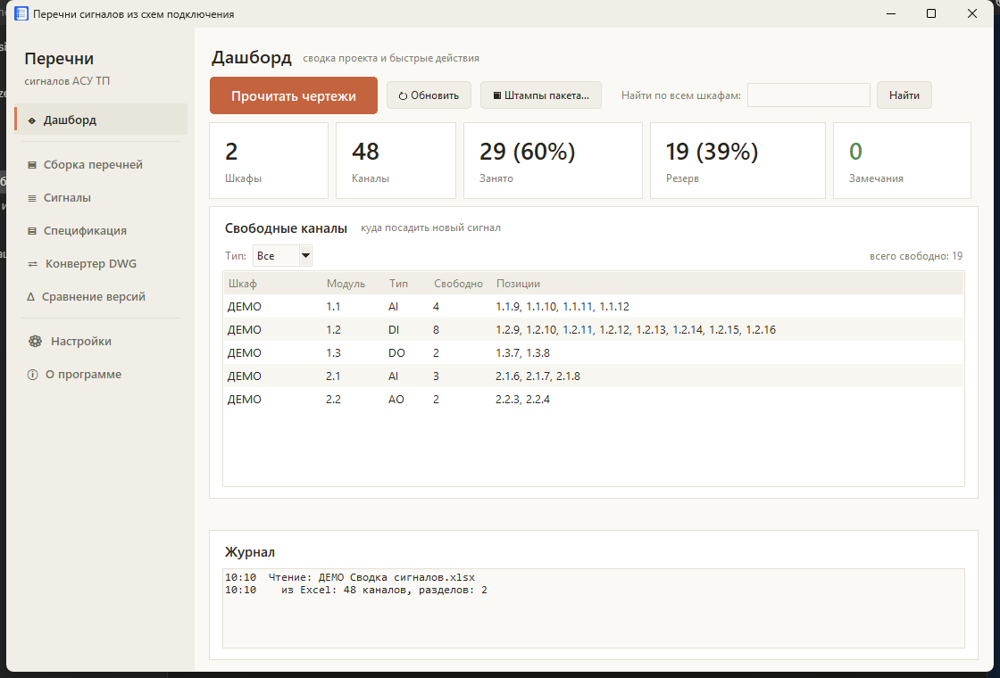
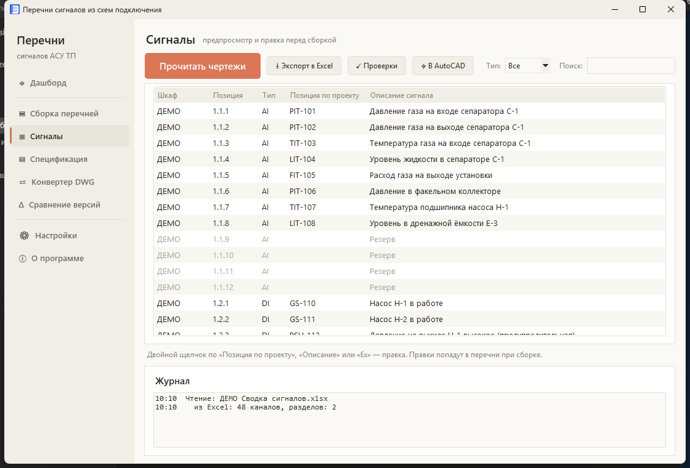
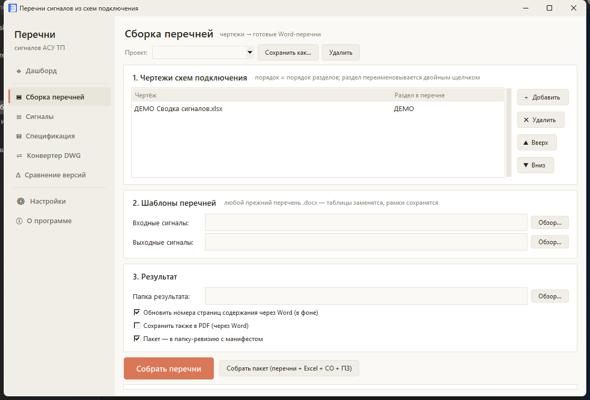

<div align="center">

# ⚡ Перечни сигналов из схем подключения

**Настольное приложение, которое автоматизирует выпуск проектной документации АСУ ТП:
читает чертежи схем подключения (DWG/DXF) и заполняет Word-перечни сигналов по ГОСТ.**


</div>

---

## 💡 Зачем

Выпуск перечней входных/выходных сигналов АСУ ТП обычно делается **вручную**: сотни позиций
переносятся из чертежей в Word-документы — это дни работы и человеческие ошибки.

Приложение делает то же самое за минуты: **чертежи `DWG/DXF` на входе → готовые Word-перечни по ГОСТ на выходе**,
с сохранением рамок, штампов и содержания.

> **Проверено на реальном проекте:** 645 сигналов · **0** расхождений с ручной сборкой · **минуты вместо дней**.

---

## 🖥️ Как это выглядит

**Дашборд** — сводка проекта, занятость каналов и таблица свободных позиций:



**Сигналы** — предпросмотр всех извлечённых каналов с правкой и фильтром:



**Сборка перечней** — чертежи → шаблоны → готовые документы:



> На скриншотах — синтетические демо-данные (`examples/demo-signals.xlsx`), реальные проектные данные не публикуются.

---

## ✨ Возможности

- **◈ Дашборд** — занятость каналов по шкафам, таблица свободных каналов под новые сигналы, глобальный поиск.
- **▣ Сборка перечней** — из чертежей и docx-шаблонов, с автопростановкой номеров страниц в содержании через Word.
- **≣ Предпросмотр сигналов** — фильтр AI/AO/DI/DO/WI, правка тегов и описаний,
  счётчик резерва и каналов без позиции, переход к каналу в AutoCAD или печать
  одного листа в PDF (без AutoCAD, секунды вместо минут на весь чертёж).
- **✓ Автопроверки** — дубли позиций, пропуски каналов, «Резерв» с тегом, один тег с разными описаниями.
- **⚖ Сверка с чертежами** — подтверждает, что в перечень попало всё: сверяет позицию,
  описание, уровень сигнала, взрывозащиту и вид контроля, ловит потерянные, лишние
  и задвоенные строки. Идёт автоматически после сборки; отдельной кнопкой можно
  сверить любой готовый перечень, ничего не перевыпуская. Отчёт — в Excel.
- **Журнал с фильтром** «только замечания» и сохранением в файл; отчёты сверок
  складываются в папку «Сверки» рядом с результатом — видно, когда расхождение появилось.
- **Δ Сравнение версий** — чертежи ↔ прежние перечни: добавлено / удалено / изменено, отчёт в Excel.
- **⇄ Конвертер DWG → DXF** — движок ищется сам: AutoCAD (`accoreconsole`) или бесплатный ODA File Converter.
- **▤ Спецификация и пояснительная записка по ГОСТ** — оба документа собираются
  из шаблонов с рамкой и основной надписью: лист А4, сквозная нумерация позиций,
  названия таблиц по ГОСТ 2.105, номера листов в содержании — полями, а не
  числами. Переверстывать после выпуска не приходится.
- **▤ Пакетная сборка** — перечни, спецификация, записка, Excel-сводка и
  ведомость комплектации — в папку «Ревизия NN» с паспортом выпуска.
- **⎙ PDF по листам** — печать чертежей полистно с автоопределением форматов ГОСТ 2.301 (А5…А0 и удлинённые А4х3…, книжные/альбомные): каждая рамка — отдельная страница 1:1, AutoCAD для печати не нужен.
- Тема подхватывается из системной настройки Windows, перетаскивание файлов мышью,
  сохраняемые наборы проектов, словарь сокращений для длинных описаний.

---

## 📋 Что берётся из чертежа

| Колонка перечня        | Источник в чертеже                                          |
|------------------------|------------------------------------------------------------|
| Позиция по проекту     | тег из описания канала («поз. PIT-1(23).»)                  |
| Описание сигнала       | текст описания канала (MTEXT)                               |
| Уровень сигнала        | аналоговые — «4-20 мА», дискретные — «=24В»                 |
| Взрывозащита           | **Exia** при наличии барьера искрозащиты (БИЗ), иначе **Exd** |
| Позиция в контроллере  | адрес `модуль.канал`, например `2.19.1`                     |
| Резервные каналы       | строки «Резерв» — видно свободные ресурсы                  |

---

## 🚀 Запуск

Из исходников:

```bash
pip install -r requirements.txt
python perechni_gui.py
```

Демо-данные для быстрого старта: **`examples/demo-signals.xlsx`**
(на странице «Сборка» добавьте его как источник вместо чертежа).

Если библиотеки не установлены, программа скажет об этом окном при запуске
и подскажет команду — разбираться в трассировке не придётся.

### Шаблоны

Указывать шаблон не нужно: программа берёт встроенные из папки `templates`
рядом с собой. Их четыре — перечень входных, перечень выходных, спецификация
оборудования и материалов, пояснительная записка. Все сделаны из выпущенного
комплекта, поэтому несут лист А4 с рамкой и основной надписью по ГОСТ 2.104.

В штампах шифр, наименование объекта и заказчик заменены на «Заменить»,
даты — на «sss»; фамилии разработчика, проверяющего и утверждающего оставлены.
Поправьте под свой проект один раз — и дальше все документы будут выходить
с вашим штампом. Свой шаблон перечня (любой прежний `.docx`) можно указать
в «Настройках» — тогда используется он.

В шаблоне записки, кроме штампа, словом «Заменить» помечены данные проекта:
наименование системы, заказчик, договор, техническое задание, сроки. Текст
разделов — общий для проектов — оставлен: его достаточно вычитать, а не
писать заново.

### Что попадает в спецификацию

В спецификацию идут **шкафы как единицы поставки**, а не их начинка. Модули,
барьеры искрозащиты, автоматы, реле, клеммы и вентиляция в неё не включаются:
шкаф поставляется укомплектованным, и если его наполнение перечислено ещё и
отдельными позициями, заказчик вправе потребовать это оборудование
дополнительно — сверх уже установленного в шкафу.

Подробный состав шкафов никуда не пропадает: он выгружается кнопкой
**«Ведомость комплектации (Excel)»** — это рабочий документ для закупки и
сборки, не для передачи заказчику.

### Сверка

После каждой сборки программа сверяет получившиеся перечни с чертежами и
пишет вердикт в журнал. Сравниваются все графы, а не только позиция с
описанием; отдельно ловятся потерянные, лишние и задвоенные строки.
Сверяются только те направления, для которых есть перечень: если собран
лишь перечень входных, выходные каналы отсутствующими не считаются.

Готовый перечень можно сверить и без пересборки — кнопка **«Сверить с
чертежами»** на странице «Сравнение версий». Полезно, когда документ пришёл
от коллеги или из архива.

### Проверка собранной программы

У готового `.exe` есть режим без окна — он проверяет то, что чаще всего
отваливается при сборке (данные matplotlib, ezdxf, шаблоны, шрифты):

```
Perechni-signalov-v2.5.exe --selftest
Perechni-signalov-v2.5.exe --selftest C:\путь\чертёж.dxf
```

С чертежом дополнительно прогоняется вся цепочка: разбор → сборка перечней →
сверка → печать PDF. Отчёт показывается окном и пишется в файл
`проверка сборки.txt` рядом с программой.

### Самопроверка

```bash
python selftest.py
```

Проверяет разбор описаний, распознавание форматов ГОСТ, подстановку шрифтов
и чтение демо-данных. На диске ничего не меняет. Стоит прогонять после
обновления библиотек и перед сборкой `.exe`.

---

## ⚙️ Настройка под свои чертежи

Программа рассчитана на определённое оформление схем. Если ваши чертежи
устроены иначе, положите рядом с программой **`config.json`** — править
исходники не нужно.

```json
{
  "extract": {
    "layer_desc": "Текст",
    "layer_biz":  "mark2",
    "layer_di":   "Реле DI (1-KL)",
    "layer_do":   "Реле DO (3-KL)"
  },
  "oda_exe":  "C:\\ODA\\ODAFileConverter.exe",
  "acad_exe": "C:\\Program Files\\Autodesk\\AutoCAD 2025\\acad.exe"
}
```

Если на слое описаний ничего не нашлось, программа выведет в журнал список
слоёв, где текст действительно лежит, — останется вписать нужный.

### Как определяются каналы

По порядку, пока не найдётся:

1. **по подписям каналов** — на схемах соединения каждый канал подписан своей
   позицией по контроллеру: «3.2.1+», «z2.2.15-». Это самый надёжный способ:
   известны и точный номер канала, и его место на листе, поэтому описание
   берётся то, что стоит напротив, а не то, что оказалось следующим по счёту;
2. **по якорям реле** — метки вида «1.2-KLDI3» на слоях дискретных модулей;
3. **по полосе модуля** — описания, попавшие между соседними заголовками,
   раздаются каналам по порядку сверху вниз.

Число каналов модуля берётся из его заголовка: «AI8x4...20mA» — восемь,
«16DIх24 VDC» — шестнадцать.

Чертёжную приставку у номера модуля («Модуль z1.5 DO» у контура ПАЗ) проекты
записывают в перечень по-разному: где-то «z2.2.1», где-то «1.6.1». Задаётся
ключом `"module_prefix"`: `"drop"` (по умолчанию) или `"keep"`.

### Что отличается от проекта к проекту

Прогон по семи проектам показал: устройство схем везде одно, а вот записи
различаются. Программа понимает обе принятые формы сама:

- **заголовок модуля** — короткий «Модуль 1.1 AI 8AIx4...20mA» и развёрнутый
  «Модуль ввода дискретных сигналов 6.1 DI, 6ES7131-6BH01-0BA0»;
- **подпись канала** — «4.7.1+» и «1.0 AI1+».

Настройками задаются две вещи, которые из чертежа не выводятся:

```json
{ "extract": {
    "kc_format": "{mod} {type}{ch}",
    "module_prefix": "keep"
} }
```

`kc_format` — как записывать позицию в контроллере: `"{mod}.{ch}"` даёт
«1.0.1» (по умолчанию), `"{mod} {type}{ch}"` — «1.0 AI1». `module_prefix` —
оставлять ли чертёжную приставку контура ПАЗ («z2.2.1») или отбрасывать её
(«2.2.1»). Оба варианта встречаются в выпущенных перечнях, угадать нельзя.

Шкафы с одинаковым обозначением в разных зданиях («ШС1. Здание 192Л» и
«ШС1. Здание 195Л») различаются по месту установки и в один раздел не сливаются.

### Насколько заполняется «позиция по проекту»

Автоматизируется не полностью, и дело не в программе, а в устройстве схем.
Замер на выпущенных вручную перечнях: у **аналоговых входов позиция находится
верно в 87 %** случаев, у дискретных выходов — примерно в половине, у дискретных
входов — почти нет.

Причина: аналоговый прибор подписывает свои жилы сам («PT21/1+», «PT21/1-»),
а дискретный сигнал идёт через промежуточное реле, и на жиле стоит обозначение
реле. Обозначения прибора в схеме подключения просто нет — проектировщик берёт
его из опросных листов и схем ТХ.

Поэтому графа заполняется там, где обозначение действительно есть в чертеже, и
остаётся пустой там, где его нет: пустая клетка видна и заполняется, а чужое
обозначение уходит в документ молча. Пропуски удобнее всего закрыть на странице
«Сигналы» — там же показано, сколько каналов осталось без позиции.

### Как заполняется «позиция по проекту»

По порядку, пока не найдётся:

1. **из описания** — оборот «поз. PIT-1(23).»;
2. **из самого описания** — первый латинский тег с цифрой («…загазованности YP9»);
3. **из подписи рядом на чертеже** — во многих схемах позиция не пишется в
   описании, а стоит подписью жилы слева: «PI 3211 +» и «PI 3211 -». Программа
   берёт ближайшую по горизонтали в узкой полосе по вертикали, но только если
   она заметно ближе следующей. Если на одной высоте два разных кандидата,
   графа остаётся пустой — лучше пусто, чем неверно.

Обозначения каналов модуля (`AO-1`, `DI-12`) и клеммники (`XT1`) позицией не
считаются. Технологические позиции аппаратов («поз. 54б/1») — тоже: это
позиция ёмкости, а не прибора.

Автоподбор по подписям отключается ключом `"guess_tags": false`.

Пути к конвертерам можно задать и переменными окружения `PERECHNI_ODA`
и `PERECHNI_ACAD`. Обычно указывать ничего не нужно: AutoCAD и ODA File
Converter находятся сами.

### Слои определяются сами

Указывать слои обычно не нужно: программа находит их по содержимому чертежа —
слой описаний по тому, где лежат осмысленные подписи сигналов, слои якорей по
меткам вида `1.2-KLDI3`, слой БИЗ по метке искрозащиты. Слой `0` при этом
берётся в последнюю очередь: в AutoCAD туда попадает всё подряд.

Заданный в `config.json` слой всегда важнее: автоопределение включается только
там, где указанный слой в этом чертеже пуст. Что выбрано, видно в журнале.
Отключается ключом `"auto_layers": false`.

### Словарь сокращений

Описания в чертежах длинные: на реальных проектах медиана 66 знаков, а больше
половины строк — длиннее 60. В таблице перечня это лишние переносы.

Рядом с программой лежит **`abbrev.json`** — пары «как в чертеже» → «как в
перечне»:

```json
{ "замены": {
    "технологические трубопроводы": "технол. трубопроводы",
    "Контроль давления": "Контр. давления",
    "трубопровод": "т/провод"
} }
```

Замена идёт по целым словам и без учёта регистра, от длинных пар к коротким
(поэтому «Контроль давления» срабатывает раньше, чем «Контроль»), заглавная
первая буква сохраняется. «трубопроводчик» при паре «трубопровод» не тронется.

Сокращения применяются при разборе чертежа, поэтому один и тот же текст идёт
и в предпросмотр, и в Word, и в Excel, и в сверку. Чтобы выключить — удалите
файл или очистите раздел «замены». Дополнить словарь можно и через
`config.json`, раздел `"abbrev"`.

### Перетаскивание файлов

Чертежи, Excel-сводки и перечни `.docx` можно не выбирать кнопкой, а
перетащить мышью в соответствующий список или поле. Нужна библиотека
`tkinterdnd2` (входит в `requirements.txt`); если её нет, программа скажет
об этом в журнале, а файлы по-прежнему добавляются кнопкой.

### Как печатаются листы

Листы печатаются монохромом, как AutoCAD со стилем `monochrome.ctb`: цвет
слоя на бумагу не идёт, а толщина линии идёт. Рамка и основные линии выходят
своей толщиной (0.4…0.7 мм), тонкие остаются тонкими, зелёная на экране рамка
и голубые адреса становятся чёрными — такими, какими их и задумывали для
печати. Галочка «Цветная печать» оставляет цвета чертежа.

Один испорченный объект больше не рвёт лист: если ezdxf не может нарисовать
сущность (так ведёт себя `ACAD_TABLE`, который держит свои SHX мимо таблицы
стилей), она пропускается, а в журнал уходит строка о том, что и сколько
не нарисовано.

### Шрифты при печати чертежей в PDF

SHX-шрифты AutoCAD (`gostw.shx`, `GOST.shx`) сторонними средствами не
рисуются, поэтому заменяются на TTF — по умолчанию `ISOCPEUR`, он ставится
вместе с AutoCAD. Если его нет, берётся первый доступный, а в журнал уходит
предупреждение: начертание изменится.

В ГОСТ-овских SHX латинская `N` нарисована как знак номера `№`, у TTF такого
соответствия нет. Поэтому в надписях основной надписи (`Инв.N подл.`,
`Взам. инв.N`, `N докум.`) знак `№` восстанавливается — и в пространстве
модели, и внутри блоков. Сплошной замены `N` на `№` не делается: в чертежах
есть законные `NB1-63`, `L+N`, `NDR-240-24`.

---

## 🧰 Стек

`Python` · `Tkinter` · `ezdxf` (чтение DXF) · `python-docx` (генерация Word) · `openpyxl` (Excel) · AutoCAD / ODA File Converter (DWG→DXF)

---

## 📄 Лицензия

Некоммерческая, без права продажи — см. [LICENSE](LICENSE).
Свободно для личного и рабочего использования, изучения и доработки;
**продажа и коммерческое распространение запрещены** без письменного разрешения автора.
